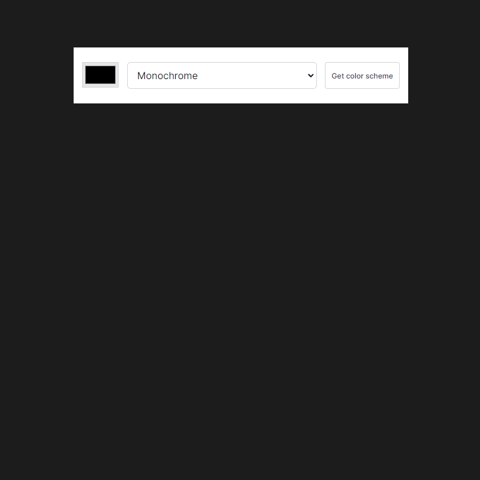
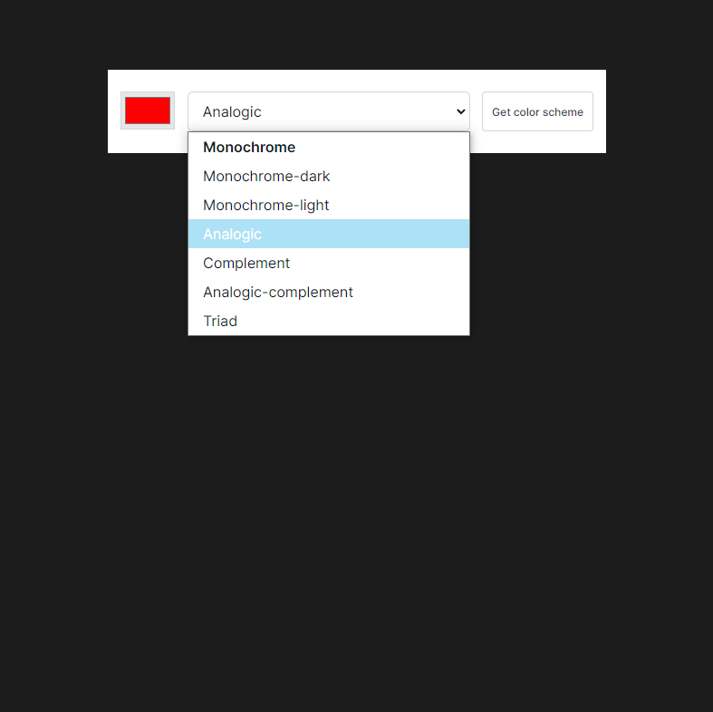
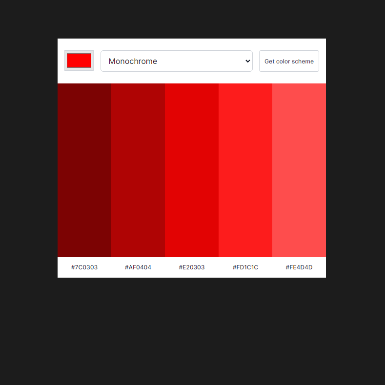
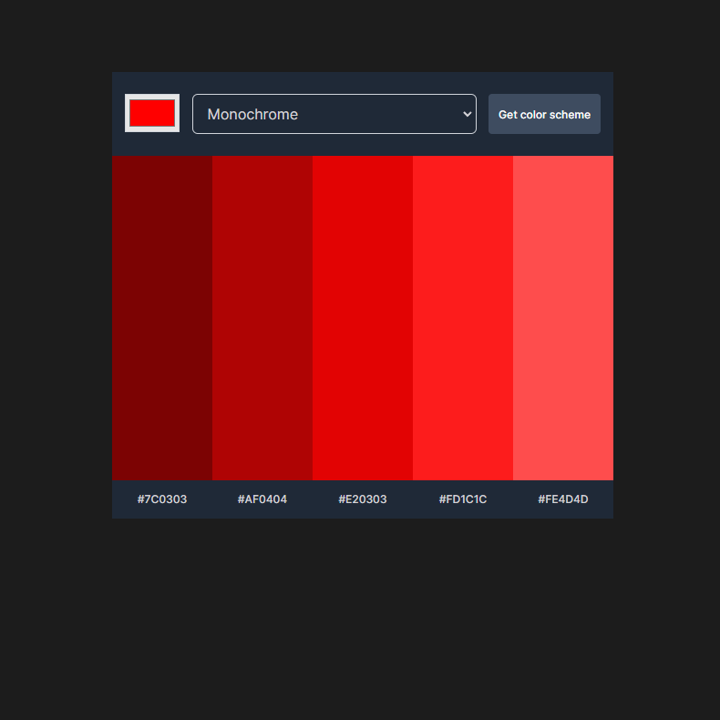

# Scrimba - The Frontend Developer Carrer Path - Module 8 - Color Scheme Genrator project

Hello and welcome! Thank you for stopping by.🤠

This is a solution to the Color Scheme Genrator project from _Module 8 - Working with API_ of the [The Frontend Career Path](https://scrimba.com/learn/frontend).

## Table of contents

- [Overview](#overview)
  - [The project](#the-challenge)
  - [Screenshot](#screenshot)
  - [Links](#links)
- [My process](#my-process)
  - [Built with](#built-with)
  - [What I learned](#what-i-learned)
  - [Continued development](#continued-development)
- [Author](#author)
- [Acknowledgments](#acknowledgments)
- [About Scrimba](#about-scrimba)

## Overview

### The project

The Color Scheme Generator allows users to:

- Choose prefered color from color picker
- Select prefered color mode selection
- Show the color scheme on demand
- Copy hex code of prefered color to clipboard

### Screenshot

Default

Mode selection

Color scheme

Color scheme - dark

### Links

- Solution URL: [Github Repository](https://github.com/PetrValenta92/color-scheme-generator)
- Live Site URL: [Github Pages](https://petrvalenta92.github.io/color-scheme-generator/)

## My process

### Built with

- Semantic HTML5 markup
- CSS custom properties
- Javascript
- API requests
- Query strings
- Mobile first design
- Accessibility focus design
- Responsive design

### What I learned

On this project, I repeated my knowledge of HTML, CSS and Javascript. I learned how to work with API requests and queries for specific data and how to work with this data to return what the user wants. Last but not least, I learned how to copy data to a clipboard.

### Continued development

In the future, I would like to add a toggle button that would allow the user to choose which (light or dark) mode they prefer. Currently the mode setting responds to the user's browser and system settings.

## Author

- Website - _to be added..._
- GitHub - [@PetrValenta92](https://github.com/PetrValenta92)
- LinkedIn - [@valentapetr](https://www.linkedin.com/in/valentapetr/)
- Instagram - [@petr_thedev](https://www.instagram.com/petr_thedev/)

## Acknowledgments

I would love to thank whole [Scrimba](https://scrimba.com) team for this project they have created. Also I want to thank the Scrimba community and specialy the [Junior Guru Community](https://junior.guru/) community for support! 🐣

## About Scrimba

At Scrimba our goal is to create the best possible coding school at the cost of a gym membership! 💜
If we succeed with this, it will give anyone who wants to become a software developer a realistic shot at succeeding, regardless of where they live and the size of their wallets 🎉
The Frontend Developer Career Path aims to teach you everything you need to become a Junior Developer, or you could take a deep-dive with one of our advanced courses 🚀

- [Our courses](https://scrimba.com/allcourses)
- [The Frontend Career Path](https://scrimba.com/learn/frontend)
- [Become a Scrimba Pro member](https://scrimba.com/pricing)

Happy Coding!
